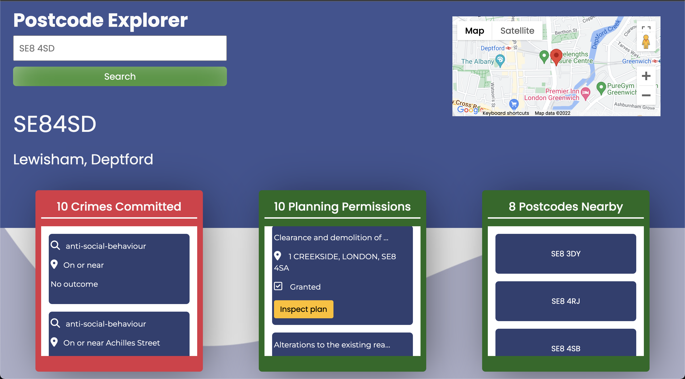
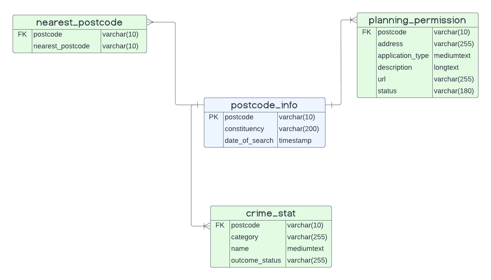

# Postcode Explorer - Get your lay of the land.

[Check out the live site here](https://xander-capstone-bucket.s3.us-east-2.amazonaws.com/index.html)

When you make your next big move, you want to know that you won't be met with any big surprises. Use the postcode inspector to clue yourself up on crimes in your area, or any construction plans that might hinder your ability to get out of your driveway.

If you don't like the look of a postcode that you searched for, just click on one of the nearby postcodes to see what they have to offer!

# Technologies Used

## Backend
The project's API was build using Amazon AWS API Gateway, with Lambda Integrations to handle the various third-party API calls. SQL is used to cache data, which was built using SQL workbench.

## Frontend
VueJS was utilized to build the frontend, along with HTML and SASS (SCSS). It was my first time using VueJS; I understand that my component architecture is non-existent (I built the entire application in one component, using one HTML file). Looking forward to future projects, I will certainly make the effort to follow guidelines and best practices, particularly when it comes to application architecture.

The Google Maps API was integrated into the project, to allow the user some visual feedback, regarding the given postcode they are inspecting.

## Deployment

Since this is a static project, Amazon AWS S3 was used to handle the files and dependencies needed. Continuous Integration is leveraged through used AWS Code Pipeline, connected to this Github repository.

# Database Schema

Below is a diagram illustrating the entity relationships for the four tables used
to build the database.

I hope you enjoy inspecting my work. Thanks for your time!